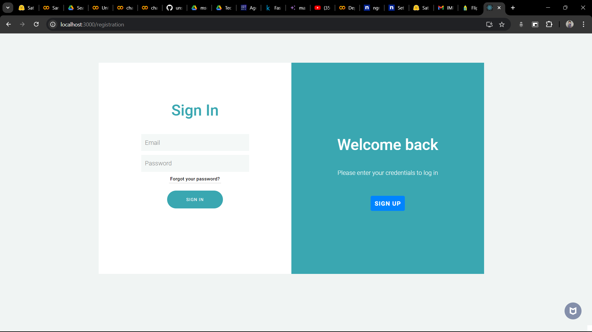
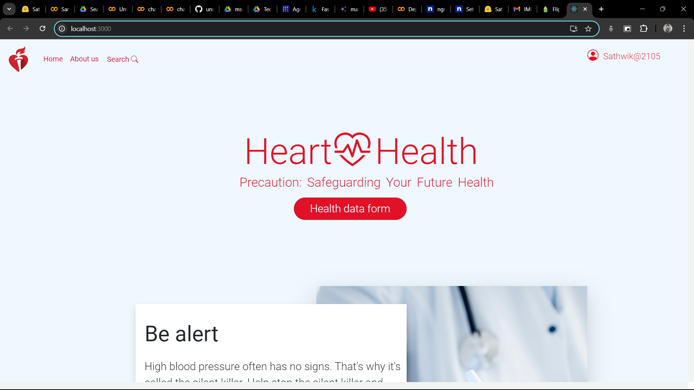
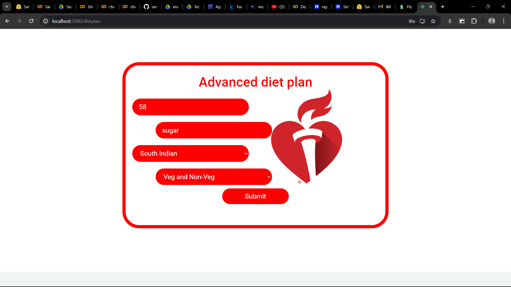
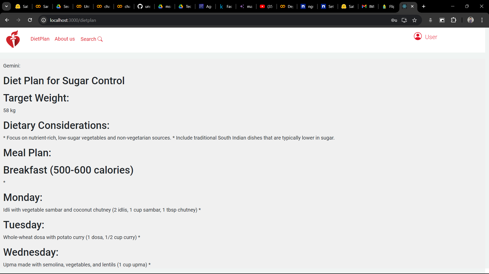
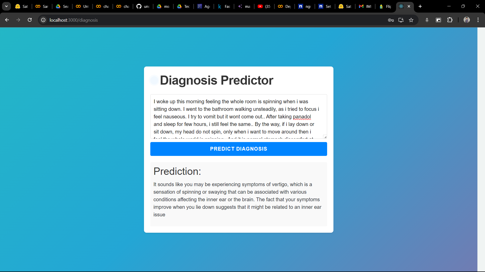
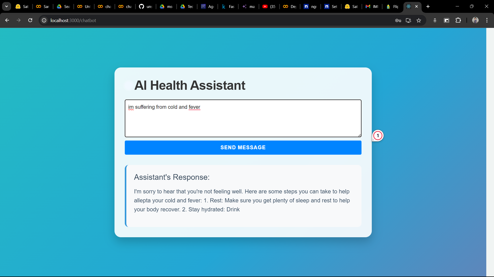
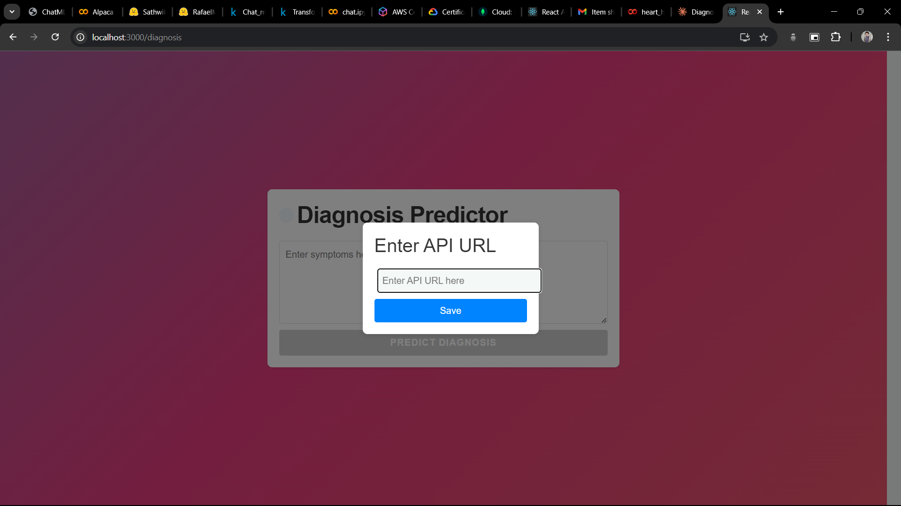

# AI-Health-Agent

# HealthCare Project

## Project Overview

The HealthCare Project is a comprehensive web application designed to assist users in managing and monitoring their health through various AI-powered features. It includes functionalities such as health risk prediction, personalized diet plans, health condition diagnosis, and a health assistant chat feature.

## Features

1. **Login and Sign Up**

   - Secure login and sign-up system for user account creation and access to personalized features.

2. **User Dashboard**

   - Accessible upon successful login.
   - User icon at the top left corner reveals a drop-down box with the following features:
     

   a. **Check Heart Health**

   - Form for inputting health details (age, cholesterol levels, etc.).
   - Random Forest ML model analyzes data to predict heart-related risks.
   - Provides risk prediction, heart condition summary, and potential issue diagnosis.
     

   b. **Fetch Diet Plan**

   - Form for requesting personalized diet plans based on weight, dietary preferences, and regional food choices.
   - UAgent integrated with Gemini generates tailored diet plans.

   

   

   c. **Health Condition Diagnosis**

   - Chat interface for describing health issues.
   - LLM-powered system simulates a patient-doctor conversation for diagnosis.

   

   d. **Health Assistant Chat**

   - Chat box for general health advice and assistance, powered by an LLM.

   

## Steps to Run the Project

Run the following steps in three separate terminals:

1. **Frontend**
   ```bash
   cd experiment
   npm start
   ```
2. **Backend**

   ```
    cd server.js
    node server.js

   ```

3. **Uagent**

```
cd server.js
cd Agents
python gemini.py
```

## Getting a Google API Key

- - To use certain features of this application, you'll need a Google API key. Here's how to obtain one:

**Create a Google Cloud Project**

- Go to the Google Cloud Console.
- Create a new project or select an existing project.
- Enable the Necessary APIs
- In the Google Cloud Console, navigate to API & Services > Library.
- Search for the required APIs (e.g., Google Cloud Natural Language API, Google Cloud Vision API).
- Enable the APIs you need for your project.
  **Create Credentials**
- Go to API & Services > Credentials.
- Click on Create Credentials and select API Key.
- A new API key will be generated. Copy this key and keep it secure.
- Set Up Billing
  Some APIs require billing information. Ensure you have set up billing in your Google Cloud project.
  **Use the API Key**
- In your project, replace the placeholder with your API key where necessary.

## Run on Google Colab

Run a colab file in Google Colab, click the link below:

[](YOUR_COLAB_LINK_HERE)

### API Key Generation

1. Click the Colab link above.
2. Follow the instructions to generate an API key.
3. Use the API key to run the file.
4. You will receive local links to integrate this Colab into the project.
   5..Add that link in the chatbox.jsx (in experiment folder/src/paths) file in the specified place .
   
